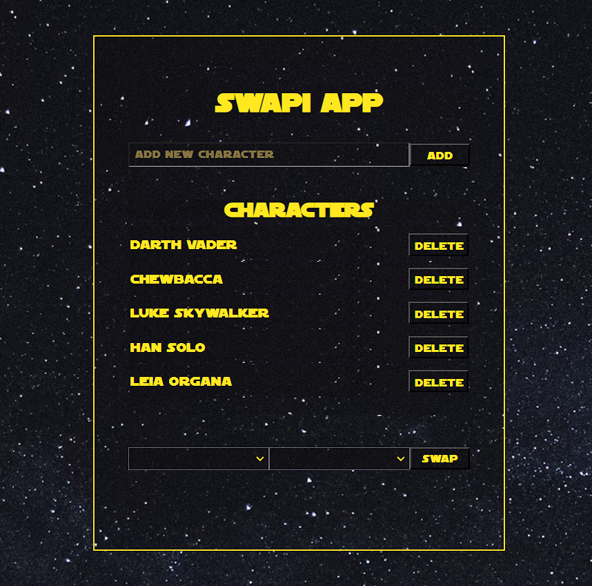

# StarWars API

## Table of Contents

1. [Project Overview](#project-overview)
2. [Installation and Setup](#installation-and-setup)
3. [API Endpoints](#api-endpoints)
4. [Project Structure](#project-structure)
5. [Image of StarWars App](#Image-of-StarWars-App)
6. [Technologies Used](#technologies-used)
7. [Database Configuration](#database-configuration)

## Project Overview

**Project Name:** StarWars API

**Description:** The StarWars API project enables management and interaction with a collection of Star Wars characters. It includes functionalities such as adding, deleting, and swapping characters, facilitated by a React-based frontend and an Express.js backend, with data fetched from an external API and stored in a MongoDB database.

## Installation and Setup

### Prerequisites

- **Node.js:** Install from [nodejs.org](https://nodejs.org/).
- **npm (Node Package Manager):** Comes bundled with Node.js.
- **MongoDB:** For local setup, MongoDB installed on your machine. For cloud setup, a MongoDB Atlas account.
- **Git:** For version control.

### Installation Steps

Clone the repository:

```sh
git clone https://github.com/PhilHacks/node-starwars-api.git
```

#### Backend Setup

Navigate to the backend directory:

```sh
cd node-starwars-api/backend
```

Install dependencies:

```sh
npm install
```

Start the backend server:

```sh
npm start
```

#### Frontend Setup

Open a new terminal window. Navigate to the frontend directory:

```sh
cd ../frontend
```

Install dependencies:

```sh
npm install
```

Start the frontend application:

```sh
npm start
```

## API Endpoints

The backend API provides endpoints for managing characters, including:

- `GET /characters/` - Retrieve all characters.
- `POST /characters/add` - Add a new character.
- `DELETE /characters/remove/:id` - Remove a character by ID.
- `POST /characters/swap` - Swap positions of two characters.

# Project Structure

The project is divided into two main parts: `backend` and `frontend`.

## Backend

The backend codebase is located in the `backend` directory and it's structured as follows:

```
backend/
├─ src/
│ ├─ handler.js - Handles the business logic for API endpoints.
│ ├─ mongoConnection.js - Manages the MongoDB database connection.
│ ├─ mongoOperations.js - Performs database operations like CRUD.
│ ├─ server.js - Sets up the Express server and API routes.
│ └─ swapi.js - Handles fetching data from the external Star Wars API.
├─ .gitignore - Specifies files to ignore in version control.
├─ main.js - The main entry point for the backend server.
└─ package.json - Defines the project and its dependencies.
```

## Frontend

The frontend codebase is located in the `frontend` directory. It's a React application structured as follows:

```
frontend/
├─ public/ - Contains the static files served by the React application.
│ └─ img/
│ └─ swapi.png - The application's screenshot for documentation.
├─ src/
│ ├─ components/ - Contains all the React components.
│ │ ├─ CharacterForm.jsx - The form component for adding new characters.
│ │ ├─ CharacterList.jsx - Lists all the characters with delete functionality.
│ │ ├─ MessageComponent.jsx - Displays messages to the user.
│ │ ├─ SpinnerComponent.jsx - Shows a loading spinner.
│ │ └─ SwapCharacter.jsx - Component for swapping characters' positions.
│ ├─ services/
│ │ └─ CharacterService.js - Manages API calls for character operations.
│ ├─ App.js - The root React component that assembles the app.
│ ├─ index.css - Global styles for the app.
│ ├─ index.js - The entry point for the React application.
│ └─ setupTests.js - Configuration file for testing.
├─ .gitignore - Specifies files to ignore in version control.
├─ package-lock.json - Automatically generated for any operations where npm modifies either the node_modules tree or package.json.
└─ package.json - Defines the frontend project and its dependencies.
```

## Image of StarWars App



## Technologies Used

- Backend: Express.js, Mongoose, MongoDB.
- Frontend: React, Axios, Styled-Components.

## Database Configuration

### Connecting to MongoDB Locally

1. Ensure that MongoDB is installed on your system. If not, download and install it from the [MongoDB Download Center](https://www.mongodb.com/try/download/community).

2. Start the MongoDB service. The method varies depending on your operating system:

   - **Windows**: The MongoDB service typically starts automatically after installation.
   - **macOS/Linux**: You may need to start `mongod` manually with the following command in your terminal:
     ```shell
     mongod
     ```

3. Open MongoDB Compass, which is the official GUI for MongoDB. Connect to the default local MongoDB instance at `mongodb://localhost:27017`.

4. Create a new database for the application, for example, `mydatabase`.

5. In your project, create a `.env` file and add the following line:

   ```
   URI=mongodb://localhost:27017/mydatabase
   ```

   Replace `mydatabase` with the name of the database you created in Compass.

6. Run your Node.js application. It should now be able to connect to your local MongoDB instance using the connection string from the `.env` file.
